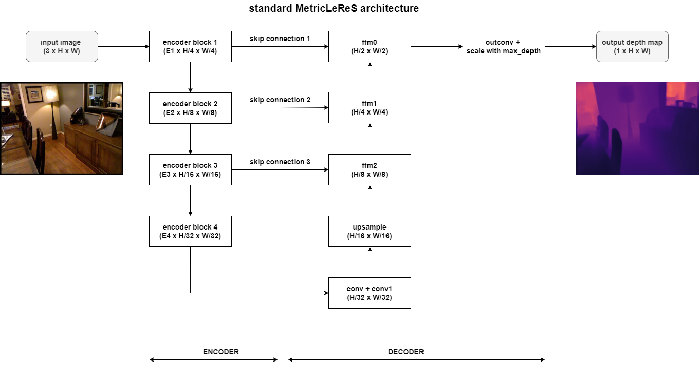
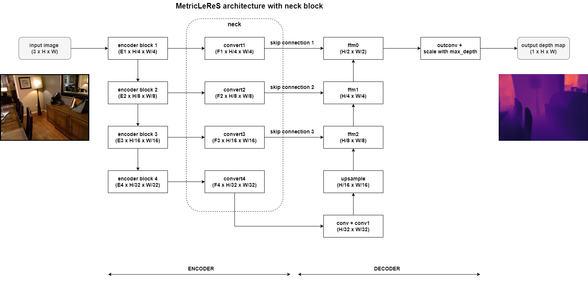

# APG METRIC DEPTH ESTIMATION

> This repository in an experimental, up-to-date version of [MetricLeReS](https://github.com/DeltaX-AI-Lab/MetricLeReS).

> If one wants to access the custom codebase for image classification model, please refer to branch [classification](https://github.com/DeltaX-AI-Lab/apg-depth-estimation/tree/classification).

A metric depth estimation model based on LeReS architecture. The model infers the absolute distance (in meters) from each pixel to the camera.

## Contents

1. [Architecture](#1-architecture)
2. [Requirements](#2-requirements)
3. [Pretrained models](#3-pretrained-models)
4. [Training](#4-training)
5. [Evaluation](#5-evaluation)
6. [Inference & Integration](#6-inference--integration)
7. [Converting model to ONNX format](#7-converting-model-to-onnx-format)

    7.1. [Converting a single model](#71-converting-a-single-model)

    7.2. [Converting multiple models](#72-converting-multiple-models)
8. [Converting model to TFlite format](#8-converting-model-to-tflite-format)

    8.1. [Converting a single model](#81-converting-a-single-model)

    8.2. [Converting multiple models](#82-converting-multiple-models)

<!-- 8. [To do](#8-to-do) -->
9. [References](#9-references)

## 1. Architecture



<!--  -->

**Notes**
- The list of supported encoders is updated [here](assets/encoders_decoders.md#1-supported-encoders)
- The list of supported decoders is updated [here](assets/encoders_decoders.md#1-supported-decoders)
- The original architecture of this model is derived from [LeReS](https://github.com/aim-uofa/AdelaiDepth/tree/main/LeReS), that's why we named it **MetricLeReS**

## 2. Requirements
- Install the Anaconda env with the following cli:
```
conda env create -f envs/ti_env.yml
```
- Activate the env:
```
conda ativate ti
```
## 3. Pretrained models

Please refer to the [model zoo](assets/modelzoo.md)

## 4. Training
Please refer to the [training guideline](assets/train.md)

## 5. Evaluation
Please refer to the [evaluation guideline](assets/eval.md)

## 6. Inference & Integration

To use our inference scripts or integrate ONNX model to your solution, please refer to the [inference & integration guideline](assets/infer.md)

## 7. Converting model to ONNX format

> **Note**: to guarantee the ONNX model can run on TI, one is suggested to use the TI environment 

### 7.1. Converting a single model

- Update the following value in YAML file ```configs/convert_onnx.yml```:

    - **weight_path**: model file path (ckpt file)
    - **output_path**: ONNX output file path (default is set as the same name with model file path)
    - **input_width**: input width, this value must be divisible by 32
    - **input_height**: input height, this value must be divisible by 32
    - **simplify**: if one wants to use [ONNX Simplifier](https://github.com/daquexian/onnx-simplifier) to simplify the output ONNX model, set it to `True`. Otherwise set is as `False` 

- Run the following cli:

```bash
python convert_onnx.py -c configs/convert_onnx.yml
```
### 7.2. Converting multiple models
<!-- > **Note**:  please make sure convert_onnx.py and convert_batch_onnx.py are placed at the same directory -->
> **Note**: Each model will be converted into its corresponding ONNX model with the same name (just replace extension to `onnx` format)

- Update the following value in YAML file ```configs/convert_batch_onnx.yml```:

    - **input_dir**: directory contains models (ckpt files)
    - **output_dir**: directory contains output ONNX models
    - **input_width**: input width, this value must be divisible by 32
    - **input_height**: input height, this value must be divisible by 32
    - **simplify**: if one wants to use [ONNX Simplifier](https://github.com/daquexian/onnx-simplifier) to simplify the output ONNX model, set it to `True`. Otherwise set is as `False` 

- Run the following cli:

```bash
python convert_batch_onnx.py -c configs/convert_batch_onnx.yml
```

## 8. Converting model to TFLite format

> **Note**: we use Google's AI Edge Torch to directly convert the model from Pytorch to TFLite. Please refer to their [original repo](https://github.com/google-ai-edge/ai-edge-torch/) to check the installation requirements & instruction.

### 8.1. Converting a single model

- Update the following value in YAML file ```configs/convert_tflite.yml```:

    - **weight_path**: model file path (ckpt file)
    - **output_path**: TFLite output file path (default is set as the same name with model file path)
    - **input_width**: input width, this value must be divisible by 32
    - **input_height**: input height, this value must be divisible by 32

- Run the following cli:

```bash
python convert_tflite.py -c configs/convert_tflite.yml
```
### 8.2. Converting multiple models
<!-- > **Note**:  please make sure convert_onnx.py and convert_batch_onnx.py are placed at the same directory -->
> **Note**: Each model will be converted into its corresponding TFLite model with the same name (just replace extension to `tflite` format)


- Update the following value in YAML file ```configs/convert_batch_tflite.yml```:

    - **input_dir**: directory contains models (ckpt files)
    - **output_dir**: directory contains output TFLite models
    - **input_width**: input width, this value must be divisible by 32
    - **input_height**: input height, this value must be divisible by 32

- Run the following cli:

```bash
python convert_batch_tflite.py -c configs/convert_batch_tflite.yml
```


<!-- ## 8. To do -->
<!-- - Support other optimization techniques (pruning, quantization, etc.)
- Publish checkpoints for other depth ranges
- Add notes for TI-board-compatible/incompatible models -->

## 9. References
- [NeW CRFs: Neural Window Fully-connected CRFs for Monocular Depth Estimation](https://github.com/aliyun/NeWCRFs)
- [Attention Attention Everywhere: Monocular Depth Prediction with Skip Attention (PixelFormer)](https://github.com/ashutosh1807/PixelFormer)
- [Learning to Recover 3D Scene Shape from a Single Image
 (LeReS)](https://github.com/aim-uofa/AdelaiDepth)
