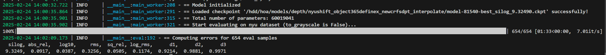
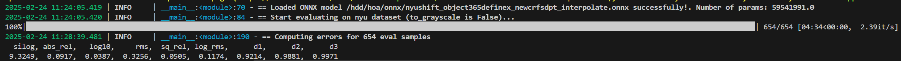
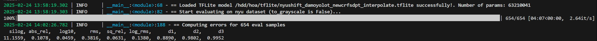

# EVALUATION GUIDELINE

## Contents
1. [Pytorch model](#1-pytorch-model)

    1.1. [Evaluating a single model](#11-evaluating-a-single-model)

    1.2. [Evaluating multiple models](#12-evaluating-multiple-models)

2. [ONNX model](#2-onnx-model)

    2.1. [Evaluating a single model](#21-evaluating-a-single-model)

    2.2. [Evaluating multiple models](#22-evaluating-multiple-models)

3. [TFLite model](#3-tflite-model)

    3.1. [Evaluating a single model](#31-evaluating-a-single-model)

    3.2. [Evaluating multiple models](#32-evaluating-multiple-models)

## 1. Pytorch model
## 1.1. Evaluating a single model
- Select the config file:
    - **NYUv2 dataset**: use [eval_nyu.yml](../configs/eval_nyu.yml) 
    - **KITTI dataset**: use [eval_kitti.yml](../configs/eval_kitti.yml)

- Update some parameters in the config file:
    - **weight_path**: path to Pytorch ckpt weight
    - **data_path_eval**: dataset directory (both KITTI and NYUv2 datasets can be found on Jupiter server)

- Run the following cli to start evaluating:

    ```
        CUDA_VISIBLE_DEVICES=[] python eval.py -c configs/[config_file_name]
    ```

    example 1 (evaluating on NYUv2 dataset):

    ```
    CUDA_VISIBLE_DEVICES=0 python eval.py -c configs/eval_nyu.yml
    ```

    example 2 (evaluating on KITTI dataset):

    ```
    CUDA_VISIBLE_DEVICES=0 python eval.py -c configs/eval_kitti.yml
    ```

- When finished, the terminal will show something like the above figure, whereas the evaluation visualization & log file (txt file) is saved at the model file directory:



### 1.2. Evaluating multiple models

> **Note**:  please make sure eval.py and eval_batch.py are placed at the same directory

- Select the config file:
    - **NYUv2 dataset**: use [evalbatch_nyu.yml](../configs/evalbatch_nyu.yml) 
    - **KITTI dataset**: use [evalbatch_kitti.yml](../configs/evalbatch_kitti.yml)

- Update some parameters in the config file:
    - **input_dir**: directory contains Pytorch ckpt weights
    - **data_path_eval**: dataset directory (both KITTI and NYUv2 datasets can be found on Jupiter server)

- Run the following cli to start evaluating:

    ```
        CUDA_VISIBLE_DEVICES=[] python eval_batch.py -c configs/[config_file_name]
    ```

    example 1 (evaluating on NYUv2 dataset):

    ```
        CUDA_VISIBLE_DEVICES=0 python eval_batch.py -c configs/evalbatch_nyu.yml
    ```

    example 2 (evaluating on KITTI dataset):

    ```
        CUDA_VISIBLE_DEVICES=0 python eval_batch.py -c configs/evalbatch_kitti.yml
    ```

## 2. ONNX model

### 2.1. Evaluating a single model
- Select the config file:
    - **NYUv2 dataset**: use [eval_nyu.yml](../configs/eval_nyu.yml) 
    - **KITTI dataset**: use [eval_kitti.yml](../configs/eval_kitti.yml)

- Update some parameters in the config file:
    - **weight_path**: path to the ONNX model
    - **data_path_eval**: dataset directory (both KITTI and NYUv2 datasets can be found on Jupiter server)

- Run the following cli to start evaluating:

    ```
        CUDA_VISIBLE_DEVICES=[] python eval_onnx.py -c configs/[config_file_name]
    ```

    example 1 (evaluating on NYUv2 dataset):

    ```
    CUDA_VISIBLE_DEVICES=0 python eval_onnx.py -c configs/eval_nyu.yml
    ```

    example 2 (evaluating on KITTI dataset):

    ```
    CUDA_VISIBLE_DEVICES=0 python eval_onnx.py -c configs/eval_kitti.yml
    ```

- - When finished, the terminal will show something like the above figure, whereas the evaluation visualization & log file (txt file) is saved at the model file directory:



### 2.2. Evaluating multiple models
> **Note**:  please make sure eval_onnx.py and eval_batch_onnx.py are placed at the same directory
- Select the config file:
    - **NYUv2 dataset**: use [evalbatch_nyu.yml](../configs/evalbatch_nyu.yml) 
    - **KITTI dataset**: use [evalbatch_kitti.yml](../configs/evalbatch_kitti.yml)

- Update some parameters in the config file:
    - **input_dir**: directory contains ONNX models
    - **data_path_eval**: dataset directory (both KITTI and NYUv2 datasets can be found on Jupiter server)

- Run the following cli to start evaluating:

    ```
        CUDA_VISIBLE_DEVICES=[] python eval_batch_onnx.py -c configs/[config_file_name]
    ```

    example 1 (evaluating on NYUv2 dataset):

    ```
        CUDA_VISIBLE_DEVICES=0 python -c eval_batch_onnx.py configs/evalbatch_nyu.yml
    ```

    example 2 (evaluating on KITTI dataset):

    ```
        CUDA_VISIBLE_DEVICES=0 python -c eval_batch_onnx.py configs/evalbatch_kitti.yml
    ```

## 3. TFLite model

### 3.1. Evaluating a single model
- Select the config file:
    - **NYUv2 dataset**: use [eval_nyu.yml](../configs/eval_nyu.yml) 
    - **KITTI dataset**: use [eval_kitti.yml](../configs/eval_kitti.yml)

- Update some parameters in the config file:
    - **weight_path**: path to the TFLite model
    - **data_path_eval**: dataset directory (both KITTI and NYUv2 datasets can be found on Jupiter server)

- Run the following cli to start evaluating:

    ```
        CUDA_VISIBLE_DEVICES=[] python eval_tflite.py -c configs/[config_file_name]
    ```

    example 1 (evaluating on NYUv2 dataset):

    ```
    CUDA_VISIBLE_DEVICES=0 python eval_tflite.py -c configs/eval_nyu.yml
    ```

    example 2 (evaluating on KITTI dataset):

    ```
    CUDA_VISIBLE_DEVICES=0 python eval_tflite.py -c configs/eval_kitti.yml
    ```

- - When finished, the terminal will show something like the above figure, whereas the evaluation visualization & log file (txt file) is saved at the model file directory:



### 3.2. Evaluating multiple models
> **Note**:  please make sure eval_tflite.py and eval_batch_tflite.py are placed at the same directory
- Select the config file:
    - **NYUv2 dataset**: use [evalbatch_nyu.yml](../configs/evalbatch_nyu.yml) 
    - **KITTI dataset**: use [evalbatch_kitti.yml](../configs/evalbatch_kitti.yml)

- Update some parameters in the config file:
    - **input_dir**: directory contains TFLite models
    - **data_path_eval**: dataset directory (both KITTI and NYUv2 datasets can be found on Jupiter server)

- Run the following cli to start evaluating:

    ```
        CUDA_VISIBLE_DEVICES=[] python eval_batch_tflite.py -c configs/[config_file_name]
    ```

    example 1 (evaluating on NYUv2 dataset):

    ```
        CUDA_VISIBLE_DEVICES=0 python -c eval_batch_tflite.py configs/evalbatch_nyu.yml
    ```

    example 2 (evaluating on KITTI dataset):

    ```
        CUDA_VISIBLE_DEVICES=0 python -c eval_batch_tflite.py configs/evalbatch_kitti.yml
    ```