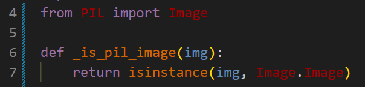
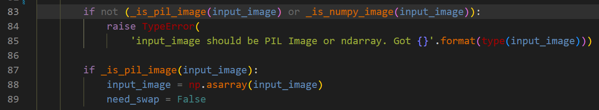

# INFERENCE & INTEGRATION GUIDELINE

- If one wants to use the inference script we provided, please refer to [Inference guideline](#1-inference-guideline)
- If one wants to integrate our ONNX inference into their custom solution, please refer to [Integration guideline](#2-integration-guideline)
- The pretrained models can be downloaded from our [Model zoo](modelzoo.md)

## 1. Inference guideline
1. Update the YAML config file `configs/infer.yml` as follows:

    - **input**: path to the input image (`jpg`/`jpeg`/`png`/`bmp` format) or video (`mp4`/`avi`/`mkv`/`mov` format) or camera index
    - **weight_path**: path to the ONNX model/Pytorch weight file
    - **normalize**: if the ONNX model/Pytorch weight model was trained with ImageNet normalization, please set it as `True`, otherwise set to `False`
    - **use_cuda**: if one wants to use CUDA, please set it as `True`, otherwise set to `False`
    - **use_tta**: if one wants to apply test-time augmentation to improve the prediction accuracy (but also slower), please set it as `True`, otherwise set to `False`
    - **output_depth_path**: if input is the image and one wants to save output depth map, please specify desired path of the output depth map here (`npy` format)
    - **output_image_path**: if input is the image and one wants to save output visualized depth image, please specify desired path of the output visualized depth image here (`jpg`/`jpeg`/`png`/`bmp` format)
    - **output_video_path**: if input is the video/camera and one wants to save output visualized depth video, please specify desired path of the output visualized depth video here (`mp4` format)
2. Run the following cli:

```bash
    python infer.py -c configs/infer.yml
```
3. (If input is video/camera) Press button `q` to stop the stream

## 2. Integration guideline
### 2.1. Requirements
#### 2.1.1. File
ONNX inference wrapper: `networks/ONNXDepthModel.py`
#### 2.1.2 Dependencies
- opencv
- numpy
- onnxruntime
- onnxruntime-gpu (if one wants to run with CUDA)
- PIL *

> Note: PIL is only needed if one wants to process Pillow image. In case you don't want to use it, please comment out/remove these lines from the file `ONNXDepthModel.py` before using:





### 2.2. How-to 
- Import and intitialize object `ONNXDepthModel`. `ONNXDepthModel` method `__init__()` has these parameters:
    - `weight_path` (str): path to the ONNX weight file
    - `use_cuda` (bool): if `True`, use CUDA GPU (default is `False`)
    - `normalize` (bool): if `True`, use ImageNet normalization (default is `True`)
    - `use_tta` (bool): if `True`, use test-time augmentation to improve the accuracy but also reduce the FPS (default is `False`)
    <!-- - `recover_original` (bool): if `True`, the output depth map has the same size with the input image, if `False`, the output depth map size is 1/4 of input image size -->

    Example:

    ```Python
    from ONNXDepthModel import ONNXDepthModel

    # ONNX file path
    model_path = 'model.onnx'

     # intialize model with default value
    model = ONNXDepthModel(model_path)
    
    # initialize model with ImageNet normalization
    model = ONNXDepthModel(model_path, normalize=True)

    # intialize model without CUDA
    model = ONNXDepthModel(model_path, use_cuda=False)

    # intialize model with TTA
    model = ONNXDepthModel(model_path, use_tta=True)
    
    ```
- Read input image using OpenCV/PIL:
 
    ```Python
    import cv2

    # read image using image read
    image = cv2.imread("image.jpg")

    # read image from webcam/video
    cap = cv2.VideoCapture(0)
    ret, image = cap.read()

    ...

    from PIL import Image

    # read image using Pillow
    image = Image.open("image.jpg")

    ```

- Estimate depth directly from input image:
    - Using `__call__` method:

    ```Python
    
    # standard usage
    depth = model(image)

    # estimate depth using test-time augmentation (improve accuracy but slower)
    depth = model(image, True)

    ```
    - Using `pipeline` method:

    ```Python
    
    # standard usage
    depth = model.pipeline(image)

    # estimate depth using test-time augmentation (improve accuracy but slower)
    depth = model.pipeline(image, True)
    ```
- (Optional) If one wants to convert the depth map into a visualized depth image, please refer to the example below:

    ```Python
    def depth_value_to_depth_image(depth, use_colormap=True):
        """Convert depth map to visualized depth image (in magma colormap)

            Args:
                depth: input depth map
                use_colormap (bool): is True use magma colormap, else grayscale (default is True) 
            Returns:
                depth_vis: visualized depth image
        """        
        min_depth = depth.min()
        max_depth = depth.max()

        if max_depth != min_depth:
            depth_vis = (depth - min_depth) / (max_depth - min_depth)
        else:
            depth_vis = depth * 0.

        depth_vis = (depth_vis * 255).astype(np.uint8)
        if use_colormap:
            depth_vis = cv2.applyColorMap(depth_vis, cv2.COLORMAP_MAGMA)
        return depth_vis 

    ...

    # visualize depth map as magma colormap format
    depth_vis = depth_value_to_depth_image(depth)

    # visualize grayscale depth map
    depth_vis = depth_value_to_depth_image(depth, False)

    ```

### 2.3. Notes

- Given the input image `image` with size `(width, height)`, the output depth map `depth` is a matrix with the same size `(width, height)`, each element is a floating-point value represents the distance from the camera to that pixel (in meter).
- Diving deeper, both `__call__` and `pipeline` methods include 3 steps:
    - `preprocess`: preprocess the input image into the suitable input format for the ONNX model
    - `predict`: ONNX model takes input data and produces model prediction
    - `postprocess`: convert the prediction from ONNX model into the output depth map 
